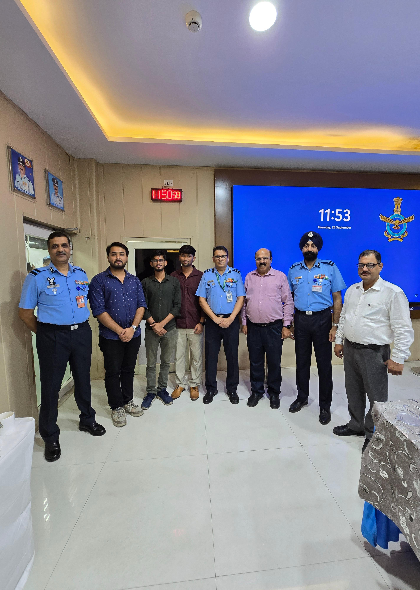

<div align="center">


# 🛡️ IQMS — Integrated Query Management System
### *Air Force CRM · IVRS · Knowledge Center · MIS*


[](LICENSE)
[](https://react.dev)
[](https://redux-toolkit.js.org)
[](https://reactrouter.com)
[](https://mui.com)
[](https://tanstack.com/query)
[](https://getbootstrap.com)
[](https://axios-http.com)
[](#)
[](#)
[](#author)

> **A production-grade React 19 + Redux Toolkit single-page application that powers query intake, triage, response, transfer, MIS reporting, telephony (IVRS dialpad + CDR), a regulatory knowledge center, and a DAV (Disabled Armed Veterans) workflow for the Indian Air Force.**

</div>

---

## 📸 Project Showcase

<div align="center">



<sub><i>IQMS rollout / handover with Indian Air Force officers and the engineering team.</i></sub>

</div>

---

## 📚 Table of Contents

1. [Overview](#-1-overview)
2. [Live Use Cases](#-2-live-use-cases)
3. [Tech Stack](#-3-tech-stack)
4. [System Architecture](#-4-system-architecture)
5. [High-Level Design (HLD)](#-5-high-level-design-hld)
6. [Folder Structure](#-6-folder-structure)
7. [Routing Map](#-7-routing-map)
8. [State Management (Redux)](#-8-state-management-redux)
9. [Authentication, RBAC & Idle Logout](#-9-authentication-rbac--idle-logout)
10. [Telephony / IVRS Layer](#-10-telephony--ivrs-layer)
11. [Data Fetching & Caching](#-11-data-fetching--caching)
12. [Theming System](#-12-theming-system)
13. [Pages — Complete Catalog](#-13-pages--complete-catalog)
14. [Components — Complete Catalog](#-14-components--complete-catalog)
15. [Hooks](#-15-hooks)
16. [Custom Modules — DAV, Knowledge Center, MIS, CDR](#-16-custom-modules--dav-knowledge-center-mis-cdr)
17. [Configuration & Environments](#-17-configuration--environments)
18. [API Layer](#-18-api-layer)
19. [Build, Run & Deploy](#-19-build-run--deploy)
20. [Security](#-20-security)
21. [Performance Notes](#-21-performance-notes)
22. [Contributing](#-22-contributing)
23. [License](#-23-license)
24. [Author](#-author)

---

## 🎯 1. Overview

**IQMS (Integrated Query Management System)** — internal codename `devicemanager`, branded **AIR FORCE CRM** — is a role-aware web application that consolidates the lifecycle of a service member's query, from telephone intake through resolution, transfer, audit, MIS reporting, and knowledge-base lookup.

| Attribute | Value |
|---|---|
| **Domain** | Defense / Government / CRM / IVRS |
| **Primary Users** | IAF Officers, Airmen, Civilian staff, CQC operators |
| **Deployment** | On-prem web app, served under base path `/app2` |
| **Runtime** | Modern evergreen browsers (Chromium, Firefox, Safari) |
| **App Title** | `AIR FORCE CRM` (see [public/index.html](public/index.html)) |
| **Package** | `devicemanager@0.1.0` (private) |

### Core Pillars

- 📞 **IVRS / Telephony** — call state machine, dialpad, CDR (received / dialed / missed)
- 📝 **Query Workflow** — incoming → replied → transferred, with full history & attachments
- 👥 **Comparison Engine** — senior/junior personnel master, rank history, basic-pay justification
- 📊 **MIS Dashboards** — APW / CPW / OPW reporting, frequent-query analytics
- 📚 **Knowledge Center** — searchable library of acts, rules, regulations, gazettes (PDF)
- ❓ **FAQ** — role-filtered, paginated, HTML-rendered
- 🪖 **DAV Module** — dedicated workflow for Disabled Armed Veterans
- 🌓 **Theming** — light / dark with CSS-variable design tokens
- 🔐 **Hardened Auth** — encrypted creds, JWT + refresh, idle auto-logout, RBAC routing

---

## 🧭 2. Live Use Cases

| Persona | Journey |
|---|---|
| **Operator** | Receives call → IVRS popup → opens query form → searches by Service No. → registers/updates query → marks status |
| **Officer** | Logs in → sees officer dashboard → reviews pending → replies / transfers → audits via MIS |
| **DAV Cell** | Opens `/home` → registers DAV-specific query → tracks via `/dav-query` |
| **Personnel User** | Searches own query by ID → views history & status |
| **Admin / Auditor** | Pulls CDR by date range → exports to CSV / PDF → cross-references with MIS |

---

## 🧱 3. Tech Stack

| Layer | Library | Purpose |
|---|---|---|
| **UI Runtime** | React 19.1.1, React DOM 19.1.1 | Concurrent rendering, transitions |
| **State (client)** | Redux Toolkit 2.8.2, React-Redux 9.2.0 | Domain state, async thunks |
| **State (server)** | TanStack React Query 5.85.9 | Server cache, refetch, dedupe |
| **Routing** | React Router DOM 7.8.1 | SPA navigation, nested routes |
| **Component kits** | MUI 7.3.5, Bootstrap 5.3.7 | Form controls, grid, dialogs |
| **Styling** | styled-components 6.1.19, Emotion 11, CSS variables | Theming, scoped styles |
| **Animation** | framer-motion 12.23.24 | Page transitions, micro-interactions |
| **HTTP** | axios 1.12.2 | API calls, interceptors |
| **Storage** | js-cookie 3.0.5, idb-keyval 6.2.2 | Cookie auth, IndexedDB cache |
| **Crypto** | crypto-js 4.2.0 | Client-side credential encryption |
| **Tables** | react-data-table-component 7.7.0 | Sortable / filterable grids |
| **Tabs** | react-tabs 6.1.0 | Tabbed views (CDR, Query history) |
| **Reporting** | jspdf 3.0.1, jspdf-autotable 5.0.2, react-csv 2.2.2 | PDF / CSV export |
| **Documents** | pdfjs-dist 4.10.38 | In-browser PDF viewer (Knowledge Center) |
| **Media** | react-player 3.3.3, dashjs 5.0.3 | DASH / HLS playback |
| **Icons** | @mui/icons-material 7.3.5, react-icons 5.5.0, lucide-react 0.545.0 | Iconography |
| **Build** | react-scripts 5.0.1 (CRA) | Dev server, bundler, Jest |

---

## 🏛️ 4. System Architecture

```
┌──────────────────────────────────────────────────────────────────────────┐
│                          BROWSER  (PWA, /app2 base)                      │
│                                                                          │
│  ┌─────────────┐   ┌───────────────────┐   ┌─────────────────────────┐   │
│  │  Login      │──▶│ AuthContext + RBAC│──▶│  DashboardLayout        │   │
│  └─────────────┘   └───────────────────┘   │  ┌──────┬─────────────┐ │   │
│                                            │  │ Side │   Topbar    │ │   │
│                                            │  │ bar  ├─────────────┤ │   │
│                                            │  │      │  <Routes/>  │ │   │
│                                            │  │      │  pages/...  │ │   │
│                                            │  └──────┴─────────────┘ │   │
│                                            └─────────────────────────┘   │
│                                                       │                  │
│      ┌────────────────────┬───────────────────────────┼───────────────┐  │
│      ▼                    ▼                           ▼               ▼  │
│  Redux Store        React Query Cache           CallContext      idb-keyval│
│  (domain state)     (server cache)              (IVRS FSM)       (offline)│
│      │                    │                           │                  │
└──────┼────────────────────┼───────────────────────────┼──────────────────┘
       │                    │                           │
       ▼                    ▼                           ▼
   ┌────────────────────────────────────────────────────────────┐
   │              axios instances (utils/endpoints.js)          │
   │  application │ telemetry │ appServices │ appTelemetry │ mcx│
   │   • Bearer JWT auth header                                  │
   │   • 401 → refresh-token queue → retry                       │
   │   • ENV-driven base URLs (utils/variables.js)               │
   └────────────────────────────────────────────────────────────┘
       │
       ▼
   Backend microservices  (IVRS gateway · CRM · MIS · CDR · KC)
```

### Architectural decisions

- **Hybrid state**: Redux for *domain* state (queries, personnel, MIS), React Query for *server* state (cacheable reads). This keeps mutations explicit and reduces re-render storms.
- **Context for cross-cutting concerns**: `AuthContext` and `CallContext` only — everything else is in Redux or React Query.
- **Layout as a route element**: `DashboardLayout` is the shared shell so sidebar/topbar persist across navigation without flicker.
- **Lazy isolation of DAV**: `src/Dav/*` is a self-contained mini-module; can be feature-flagged off.
- **Runtime config**: `public/config.js` is loaded *outside* the bundle so deployments can flip flags without rebuilding.

---

## 🧩 5. High-Level Design (HLD)

### 5.1 Layered View

```
┌─────────────────────────────────────────────────────┐
│  Presentation        pages/  components/  layouts/  │
├─────────────────────────────────────────────────────┤
│  Application Logic   hooks/  context/  Dav/         │
├─────────────────────────────────────────────────────┤
│  Domain State        actions/  reducers/  store/    │
├─────────────────────────────────────────────────────┤
│  Infrastructure      utils/ (axios, storage, cache) │
├─────────────────────────────────────────────────────┤
│  Static / Config     public/ (config.js, KC PDFs)   │
└─────────────────────────────────────────────────────┘
```

### 5.2 Query Lifecycle (state diagram)

```
      ┌──────────┐  create   ┌──────────┐  reply    ┌──────────┐
──▶   │ INCOMING │──────────▶│ ASSIGNED │──────────▶│ REPLIED  │
      └──────────┘           └────┬─────┘           └────┬─────┘
                                  │ transfer             │ reopen
                                  ▼                      ▼
                            ┌─────────────┐        ┌──────────┐
                            │ TRANSFERRED │        │ INCOMING │
                            └─────────────┘        └──────────┘
```

### 5.3 IVRS Call FSM (`CallContext`)

```
   READY ──answer──▶ IN_CALL ──hold──▶ ON_HOLD
     ▲                  │                 │
     │                  │ hangup          │ resume
     │                  ▼                 ▼
   READY ◀──reject─── RINGING_IN ◀────── IN_CALL
```

---

## 📁 6. Folder Structure

```text
iqms/
├── LICENSE                          # MIT
├── README.md                        # ← you are here
├── package.json
├── docs/
│   ├── IVRS_CRM_Updates_README.md
│   └── images/                      # Screenshots & banners used by README
│
├── public/
│   ├── index.html                   # Sets <title> to "AIR FORCE CRM"
│   ├── manifest.json                # PWA manifest
│   ├── config.js                    # Runtime configuration (NOT bundled)
│   ├── config.js.default            # Template / reference values
│   ├── knowledgeCenterConfig.json   # KC sections → PDF mapping
│   └── static/
│       └── KNOWLEDGE-CENTER-PDFS/   # Acts, Rules, Regulations
│
└── src/
    ├── App.js                       # Router root, providers, QueryClient
    ├── App.css / index.css          # Global styles
    ├── index.js                     # ReactDOM.createRoot entry
    ├── reportWebVitals.js
    ├── setupTests.js
    │
    ├── actions/                     # Redux thunks (Toolkit-style)
    │   ├── allAction.js             # Comparison (airman/officer)
    │   ├── MISAction.js             # APW/CPW/OPW reports
    │   ├── ProfileAction.js
    │   ├── queryActions.js          # FAQ + frequent queries
    │   ├── pendingQueryAction.js / pendingQueryActionNew.js
    │   ├── repliedQueryAction.js / repliedQueryActionNew.js
    │   └── transferredQueryAction.js / transferredQueryActionNew.js
    │
    ├── assets/
    │   ├── Data/                    # Static JSON (build history, enums)
    │   └── Images/                  # Logos, loaders, banners
    │
    ├── components/                  # Reusable presentational widgets
    │   ├── Button.jsx               · Card.jsx
    │   ├── ChangePasswordDialog.jsx · ConfirmDialog.jsx
    │   ├── ExtensionDialog.jsx      · FeedbackDialog.jsx
    │   ├── Footer.jsx               · Loader.jsx
    │   ├── ProtectedRoute.jsx       · QueriesTable.jsx
    │   ├── Sidebar.jsx              · SidebarDataPage.jsx · SubMenu.jsx
    │   ├── Topbar.jsx               · versionNoticeBoard.jsx
    │   └── Dialpad/Dialpad.jsx      # IVRS keypad
    │
    ├── constants/
    │   ├── appConstants.js          # Action types
    │   ├── Enum.js                  # Roles, categories
    │   ├── MISConstants.js · ProfileConstants.js · queryConstants.js
    │
    ├── context/
    │   ├── AuthContext.jsx          # User, token, refresh queue, logout
    │   └── CallContext.jsx          # IVRS finite state machine
    │
    ├── Dav/                         # Disabled Armed Veterans module
    │   ├── QueryRegistration.jsx · NewQuery.jsx · QueryView.jsx
    │   └── data.js
    │
    ├── hooks/
    │   ├── useActiveRole.js         · useCustomHook.js
    │   ├── useDataRefresher.js      · useDataRefresherNew.js
    │   ├── useIdleLogout.js         # 20-minute auto logout
    │   ├── usePendingQueries.js     · useTransferredQueries.js
    │   └── useTheme.js              # Light/Dark + persistence
    │
    ├── layouts/
    │   └── DashboardLayout.jsx      # Sidebar + Topbar + <Outlet/>
    │
    ├── pages/
    │   ├── CDR.jsx                  · Comparison.jsx
    │   ├── Dashboard.jsx            · DashboardOfficer.jsx
    │   ├── FAQ.jsx                  · FreqQuery.jsx
    │   ├── Inauguration.jsx         · IQMSMSI.jsx
    │   ├── KnowledgeCenter.jsx      · Login.jsx
    │   ├── NotFound.jsx             · SearchQuery.jsx
    │   ├── Settings.jsx             · Unauthorized.jsx · Users.jsx
    │   ├── ProfileView/             # Profile sub-pages
    │   ├── Queries/                 # Incoming / Replied / Transferred / View / Comparison
    │   └── TaskManagement/          # Tasks + Feedback
    │
    ├── reducers/
    │   ├── reducers.js              · ProfileReducers.js
    │   ├── MISReducers.js           · queryReducer.js
    │   ├── pendingQueryReducer.js   · transferredQueryReducer.js
    │
    ├── store/
    │   └── store.js                 # configureStore + devtools
    │
    ├── themes/
    │   └── defaultTheme.js          # Tokens, palette
    │
    └── utils/
        ├── axiosInstance.js         · endpoints.js     # 5+ axios clients
        ├── variables.js             # ENV-driven base URLs
        ├── MISApiCall.js            · cache.js
        ├── fetchAllPages.js         · fetchPagedIncremental.js
        ├── helpers.js               · constants.js
        ├── storage.js               # localStorage + IndexedDB
        └── users.json               # Sample user fixtures
```

---

## 🛣️ 7. Routing Map

> Base path: `/app2` · All non-public routes are wrapped by `<ProtectedRoute>` and rendered inside `<DashboardLayout>`.

| Path | Component | Role | Description |
|---|---|---|---|
| `/login` | `Login.jsx` | Public | Encrypted credential login |
| `/` | `Dashboard.jsx` / `DashboardOfficer.jsx` | All / Officer | Role-aware home |
| `/search-query` | `SearchQuery.jsx` | All | Search by Service No. / Query ID |
| `/search-results` | `SearchResults.jsx` | All | Result grid |
| `/comparision` | `Comparison.jsx` | All | Senior/Junior personnel comparison |
| `/query/comparision` | `QueryComparison.jsx` | All | Side-by-side queries |
| `/iqms-mis` | `IQMSMSI.jsx` | Officer | MIS reports |
| `/view/queries/incoming` | `IncomingQueries.jsx` | All | Pending list |
| `/view/queries/replied` | `RepliedQueries.jsx` | All | Resolved list |
| `/view/queries/transferred` | `TransferredQueries.jsx` | All | Transferred list |
| `/view/query/:id` | `QueryView.jsx` | All | Detail + history |
| `/view/profile` | `ProfileView.jsx` | All | Personnel record |
| `/FAQ` | `FAQPage.jsx` | All | Role-filtered FAQ |
| `/knowledge-center` | `KnowledgeCenter.jsx` | All | PDF library |
| `/freq-query` | `FreqQuery.jsx` | Officer | Frequency analytics |
| `/cdr` | `CDR.jsx` | Officer | Call detail records |
| `/interim-reply` | `TaskDetails.jsx` | All | Tasks / interim replies |
| `/feedback` | `FeedbackList.jsx` | All | Feedback inbox |
| `/task-create` | `CreateTask.jsx` | All | New task |
| `/home` | `QueryRegistration.jsx` (DAV) | DAV | DAV registration |
| `/dav-query` | `QueryView.jsx` (DAV) | DAV | DAV detail view |
| `/new-query` | `NewQuery.jsx` | All | New query intake |
| `/inauguration` | `Inauguration.jsx` | All | Build / release notes |
| `*` | `NotFound.jsx` | Public | 404 |

---

## 🗃️ 8. State Management (Redux)

Configured in [src/store/store.js](src/store/store.js) via `configureStore` (Redux Toolkit) with thunk middleware and DevTools enabled in non-production.

### Slice / reducer map

| Slice | Domain |
|---|---|
| `login_user` | Auth user, JWT, refresh token |
| `personalData` | Personnel master |
| `pending_queries` · `replied_queries` · `transferred_queries` | Query lifecycle |
| `query_by_id` · `query_id` · `query` | Single query lookups |
| `search_queries` | Search results |
| `profileView` | Logged-in user profile |
| `abcCodes` · `irlaView` · `porData` | Reference data |
| `airmanPersmast` · `airmanRankHistory` · `airmanBasicPayReason` | Airman comparison |
| `officerPersmast` · `officerRankHistory` · `officerBasicPayReason` | Officer comparison |
| `apwReducer` · `cpwReducer` · `opwReducer` | MIS payroll/workforce |
| `faqReducer` | FAQ catalog |
| `frqQryReducer` | Frequent queries |

### Action layout

`actions/*` exposes async thunks. The `*New.js` files supersede the legacy ones during the in-flight refactor — new code should import from `*New`.

---

## 🔐 9. Authentication, RBAC & Idle Logout

[`src/context/AuthContext.jsx`](src/context/AuthContext.jsx)

- **Cookie payload (8 h)** — `{ token, refreshToken, user: { userId, username, fullName, roles, extension } }`
- **Large profile blobs** → `localStorage` (`userDetails`, `baseUserData`)
- **Refresh queue** — concurrent 401s are deduplicated; only one refresh fires, the rest await it
- **RBAC** — `ROLE_OFFICER` → `DashboardOfficer`; everyone else → `Dashboard`
- **Route guard** — [`components/ProtectedRoute.jsx`](src/components/ProtectedRoute.jsx) redirects unauthenticated traffic to `/login`
- **Idle logout** — [`hooks/useIdleLogout.js`](src/hooks/useIdleLogout.js) (default **20 min**) — logs `agentStatus: Logout` for telemetry

---

## ☎️ 10. Telephony / IVRS Layer

[`src/context/CallContext.jsx`](src/context/CallContext.jsx) — finite state machine with reducer pattern.

| State | Permitted actions |
|---|---|
| `READY` | `START_RINGING_IN`, `SET_DIAL_STRING`, dial out |
| `RINGING_IN` | `ANSWER`, `REJECT` |
| `IN_CALL` | `HANGUP`, `MUTE`/`UNMUTE`, `HOLD` |
| `ON_HOLD` | `RESUME`, `HANGUP` |

UI: [`components/Dialpad/Dialpad.jsx`](src/components/Dialpad/Dialpad.jsx) — 0-9, `*`, `#`, mute, hold, transfer, hangup. Logs surface in [`pages/CDR.jsx`](src/pages/CDR.jsx).

---

## 🔄 11. Data Fetching & Caching

- **`QueryClient`** instantiated at app root in [src/App.js](src/App.js).
- **Custom hooks** wrap recurring fetches:
  - `usePendingQueries` · `useTransferredQueries`
  - `useDataRefresher` / `useDataRefresherNew` — interval-based refresh
- **Pagination helpers** — `utils/fetchAllPages.js` and `utils/fetchPagedIncremental.js`
- **Offline cache** — `utils/storage.js` wraps `idb-keyval` for query bundles & profile
- **In-memory cache** — `utils/cache.js`

---

## 🎨 12. Theming System

[`src/hooks/useTheme.js`](src/hooks/useTheme.js) toggles `document.documentElement` class between `theme-light` and `theme-dark`.

Tokens (CSS variables) defined in `src/themes/defaultTheme.js` and global stylesheets:

```css
--bg, --surface, --text, --muted, --border, --shadow,
--primary, --red, --blue, --green, --warning
```

Persisted in `localStorage`. Honours `prefers-color-scheme` on first visit.

---

## 📄 13. Pages — Complete Catalog

| Page | Purpose |
|---|---|
| **Login** | Encrypted creds (crypto-js) → JWT + extension picker |
| **Dashboard / DashboardOfficer** | Role-aware home with KPI cards + version board |
| **SearchQuery / SearchResults** | Lookup by Service No. or Query ID |
| **Queries/IncomingQueries** | Pending / assigned queries |
| **Queries/RepliedQueries** | Resolved queries |
| **Queries/TransferredQueries** | Forwarded to other depts |
| **Queries/QueryView** | Full detail, attachments, response thread |
| **Queries/QueryDetails** | Sub-component for metadata block |
| **Queries/QueryHistorytab** | Status timeline |
| **Queries/QueryComparison** | Diff two queries |
| **Comparison** | Senior vs Junior — master + rank history + pay |
| **IQMSMSI** | MIS — APW / CPW / OPW reports |
| **FreqQuery** | Frequency analytics, exportable |
| **FAQ** | Role-based, paginated, HTML content |
| **KnowledgeCenter** | PDF browser with section filters |
| **CDR** | Tabbed call records (received / dialed / missed) |
| **TaskManagement/TaskList … TaskHistory** | Interim replies |
| **TaskManagement/FeedbackList / FeedbackCreate** | Feedback loop |
| **ProfileView** | Personnel info |
| **Settings** | Preferences, theme, notifications |
| **Users** | Admin user management |
| **Inauguration** | Release notes & build history |
| **NotFound / Unauthorized** | 404 / 403 |

---

## 🧱 14. Components — Complete Catalog

| Component | Role |
|---|---|
| `Button` | Variant-aware button |
| `Card` | Elevated container |
| `Loader` | Spinner / skeleton |
| `Sidebar` + `SidebarDataPage` + `SubMenu` | Collapsible navigation |
| `Topbar` | User menu, theme toggle, notifications |
| `Footer` | Footer band |
| `QueriesTable` | Generic data grid for queries |
| `ConfirmDialog` | Yes/No modal |
| `ChangePasswordDialog` | Self-service password change |
| `ExtensionDialog` | Pick phone extension on login |
| `FeedbackDialog` | Inline feedback |
| `ProtectedRoute` | Auth guard |
| `versionNoticeBoard` | Surfaces release notes |
| `Dialpad/Dialpad` | IVRS keypad |

---

## 🪝 15. Hooks

| Hook | Purpose |
|---|---|
| `useActiveRole` | Resolve current role from auth |
| `useCustomHook` | Misc utilities |
| `useDataRefresher` / `…New` | Periodic background refresh |
| `useIdleLogout` | Auto-logout on inactivity |
| `usePendingQueries` | Pending list fetcher |
| `useTransferredQueries` | Transferred list fetcher |
| `useTheme` | Light/dark with persistence |

---

## 🪖 16. Custom Modules — DAV, Knowledge Center, MIS, CDR

### DAV (`src/Dav/`)
Standalone workflow for Disabled Armed Veterans — registration (`/home`), creation (`/new-query`), view (`/dav-query`).

### Knowledge Center
- Driven by [public/knowledgeCenterConfig.json](public/knowledgeCenterConfig.json)
- PDFs live under [public/static/KNOWLEDGE-CENTER-PDFS/](public/static/KNOWLEDGE-CENTER-PDFS/)
- Includes: DPPI 2013, AFT Act 2007, Income Tax Act 1961, Gratuity Act 1972, EPF Act, and 40+ more

### MIS (IQMS-MSI)
APW / CPW / OPW reducers feed the [`pages/IQMSMSI.jsx`](src/pages/IQMSMSI.jsx) report grid. Exports via `react-csv` & `jspdf-autotable`.

### CDR
[`pages/CDR.jsx`](src/pages/CDR.jsx) — tabbed Received / Dialed / Missed with date-range filters & export.

---

## ⚙️ 17. Configuration & Environments

### Runtime config — [public/config.js](public/config.js)

```js
window.APP_CONFIG = {
  application: "Coral",
  secretKey: "…",                   // crypto-js key for credential encryption
  KNOWLEDGE_CENTER_BASE_PATH: "static/KNOWLEDGE-CENTER-PDFS",
  disablePhone: false,
  enableTraceCall: false,
  demoMode: false,
  captcha: false,
  overrideURLS: false,              // ↳ if true, honor BASE_URL_API / BASE_URL_APP
  // …
};
```

> Why a runtime file? Same build artifact ships to all environments — flip flags / URLs without rebuilding.

### Build-time mode — `REACT_APP_MODE`

[`src/utils/variables.js`](src/utils/variables.js) selects API base URLs:

| Mode | Service base | Telemetry base |
|---|---|---|
| `ui-dev` | `http://api.coraltele.com/services/api/v2/` | `http://api.coraltele.com/telemetry/api/v2/` |
| `ui-local` | local URLs | local URLs |

---

## 🌐 18. API Layer

[`src/utils/endpoints.js`](src/utils/endpoints.js) defines five+ axios instances:

```js
application      // CRM domain
telemetry        // raw telemetry
opaqueTelemetry  // signed telemetry
appServices      // app-level services
appTelemetry     // app telemetry
mcx              // 3rd-party push-to-talk gateway
```

Each carries:
- `Authorization: Bearer <token>` injected from auth cookie
- 401 interceptor — refresh-token queue, then retry
- Standard error envelope: `{ status, message }`

### Representative endpoints

| Verb | Path | Purpose |
|---|---|---|
| `POST` | `/login` · `/logout` · `/refresh` | Auth lifecycle |
| `GET`  | `/queries?status=…` | Paginated query lists |
| `GET`  | `/queries/:id` | Detail |
| `POST` | `/queries` · `PUT /queries/:id` · `POST /queries/:id/reply` | Mutations |
| `GET`  | `/personnel/:id/rank-history` · `/pay-justification` | Comparison |
| `GET`  | `/faq` · `/knowledge-center/sections` | KC + FAQ |
| `GET`  | `/cdr` · `POST /cdr/filter` | Call records |
| `POST` | `/agentStatus/create` | Operator presence |

---

## 🚀 19. Build, Run & Deploy

```bash
# 1 — Install
npm install

# 2 — Configure
cp public/config.js.default public/config.js   # then edit values
export REACT_APP_MODE=ui-dev                    # or ui-local

# 3 — Develop
npm start            # → http://localhost:3000/app2

# 4 — Test
npm test

# 5 — Production build
npm run build        # → ./build  (deploy under /app2)
```

### Deploying

- Serve the `build/` folder from any static host (nginx, IIS, Apache).
- Mount under **`/app2`** (matches `homepage` in [package.json](package.json) and the router `basename`).
- Ensure SPA fallback: all unknown paths → `index.html`.

#### Example nginx snippet

```nginx
location /app2 {
  alias /var/www/iqms/build;
  try_files $uri $uri/ /app2/index.html;
}
```

---

## 🛡️ 20. Security

- 🔒 **Credential encryption** at the client (crypto-js, `secretKey` from runtime config)
- 🔒 **JWT + refresh token** with single-flight refresh
- 🔒 **Httpish cookie** for token storage (8 h expiry) + RBAC route guards
- 🔒 **Idle logout** to mitigate unattended terminals
- 🔒 **Runtime config** keeps secrets out of the bundle (operator-controlled)
- 🛑 **No** `eval` / `dangerouslySetInnerHTML` outside vetted FAQ/KC HTML rendering
- ✅ Consider adding: CSP headers, sub-resource integrity for `/static/` PDFs, anti-CSRF on mutating endpoints

---

## ⚡ 21. Performance Notes

- React 19 concurrent rendering for non-urgent updates
- React Query dedupes & caches — fewer round trips
- `idb-keyval` keeps large datasets out of `localStorage`
- Sidebar collapses to 80 px to maximize content area
- PDFs streamed on-demand via `pdfjs-dist` worker
- Code-splitting via dynamic `import()` is encouraged for new pages

---

## 🤝 22. Contributing

1. Branch from `main`: `feature/<short-name>`
2. Use the **`*New.js`** action / reducer patterns for any new query work
3. Keep new pages inside `src/pages/<Domain>/` and lazy-load if heavy
4. No new global CSS — prefer styled-components or CSS Modules
5. Run `npm test` and `npm run build` before opening a PR

---

## 📜 23. License

This project is licensed under the **MIT License** — see [LICENSE](LICENSE) for full text.

```
MIT License · Copyright (c) 2026 Rahul Singh
```

---

## 👤 Author

**Rahul Singh**
Full-Stack / Frontend Engineer · IQMS Maintainer

> Built with ❤️ for the men and women in uniform of the **Indian Air Force**.

<div align="center">


**नभः स्पृशं दीप्तम्** — *Touch the Sky with Glory*

</div>
